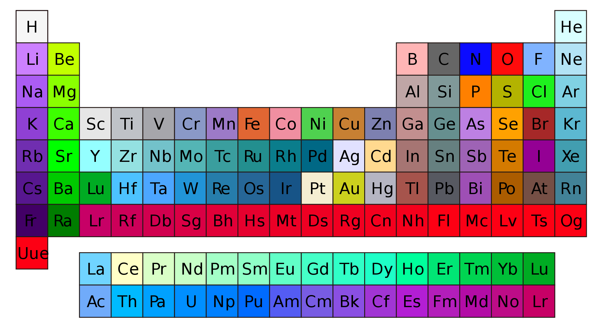

= Protein Modeling - PLANT 2030
:icons: font
:source-highlighter: rouge
:toc: left

== Prediction with AlphaFold3

Predicting with link:https://www.nature.com/articles/s41586-024-07487-w[AlphaFold3] could not be easier.
In link:https://alphafoldserver.com/[AlphaFold3 server] paste the sequence of the protein to be modeled, as well as further information on other entities to be predicted together.
If you prefer to use IPK's local installation of AlphaFold2 in the future, please check our link:https://github.com/amandascamara/Protein-Structure-Workshop[other tutorial] on the topic.
In this tutorial we will predict the structure of a Multi-drug Resistance Transporter protein (MATE). Proteins of this family sense changes in one side of the membrane, like increased acidity in the soil, and transport one molecule from the other side of the membrane as a response. Our MATE example from barley has the sequence below. Used to make a prediction of its structure with AlphaFold3
[source,]
----
>MATE_example
MAATSPAPTRAAAALTLAPNRRVHHVHMPSSRPCPCRASAAPRRRTPRCRAKPTVKGVVDDDEDASRESEPEMKEEEAMASMGTLPGWLRLDTVGMDILSIAAPAVLALAADPIAALVDTAFVGHIGSTELAAVGVSISIFNLVSKLFNVPLLNVTTSFVAEQQAVDDGYRRTGENEFRRSPDKLTEERKFLPAVTTSLALASGIGLMETVALIFGSGTLMDVIGIPVDSPVRIPAEQFLAFRAYGAPPIIVALAAQGAFRGLMDTKTPLYAIGVGNLVNAILDAIFVFPLGLGVRGAALATVTSEYVIACILLWKLNSKVVIFSGKIIAGGVIRYLKSGGLLIGRTIAVLLTMTLSTSLAAKEGAIPMAGHQLCLQVWLTISLLNDALALAGQALLATEYTKRNYKQSRIVLYRVLQIGGATGMALAIILLFGFESFSLLFTDDPAVLAIAKSGVWFVAISQPINAVAFVIDGLYYGVSDFAYAAYSMFFAGAISSAFLLVAAPQFGLGGVWAGLILFMSLRAVAGLWRLGSKGGPWNLILSETDLRDKM
----
In a few minutes, AlphaFold3 outputs a structure prediction.
Looking at it, can you recognize how this protein is set in the membrane? Which part face the lipids of the membrane, which parts face the inside or the outside of the cell, and where is the channel pore? Just make a guess and we will check for more evidences during this tutorial.

image::Figures/Figure1.png[width=500]

AlphaFold3 outputs 3 main pieces of information: the structure (colored by predicted link:https://www.ncbi.nlm.nih.gov/pmc/articles/PMC3799472/[Local Distance Difference Test] - plDDT),
the Predicted Aligned Error (PAE) and predicted link:https://en.wikipedia.org/wiki/Template_modeling_score[Template Modeling] scores for the entire protein complex (pTM) and for the residues in the interface between subnunits (ipTM), for predictions with multiple chains.

The plDDT and pTM values derive from usual comparison measurements between two protein structures (lDDT and TM). But the 'predicted' term indicates the models are compared with the ground truth.
PAE was introduced with AlphaFold2 and gives the error distance of residue x if the predicted and 'true' structures were aligned at residue y (an asymmetric matrix).
It measures the relative position between two residues.
Moreover, it reflects the relative position of domains.
In some cases, the structure of different domains is well predicted, but not their relative position,
and this appears in the PAE, as explained in the section 'How to interpret the Predicted Aligned Error' present in every entry of link:https://alphafold.ebi.ac.uk/[AlphaFold Protein Structure Database], like in this link:https://alphafold.ebi.ac.uk/entry/Q9Y223#help[example].

Downloading the results, you will get the following files:
[source,sh]
----
*_full_data_?.json <1>
*_job_Request.json <2>
*_model_?.cif <3>
*_summary_confidences_?.json <4>
terms_of_use.md <5>
----
All files can be read with text editors.

<1> For each output model, a file with lists that correspond to the chain ID and plDDT of each atom, PAE, chain ID and residue number for each residue.

<2> The input information given by the user and the seed used, so that the same prediction can be done again.

<3> These are the most expected files - five structure files, globally ranked by a mixture of pTM, ipTM, amount of disorder and clashes (model_0 has the best score).

<4> For each output model, a file with lists of pTM, ipTM and PAE for the chains, plus the fraction of disorder (here defined as above a threshold of relative solvent accessible surface area), the existence of clashes and the number of recycles used to determine the protein structure as in AlphaFold2.

<5> Terms of use from Google, which you agree upon running the prediction with a google account.

More about the output can be found on the link:https://github.com/google-deepmind/alphafold3/[github of AlphaFold3] and on the paper's link:https://static-content.springer.com/esm/art%3A10.1038%2Fs41586-024-07487-w/MediaObjects/41586_2024_7487_MOESM1_ESM.pdf[supplementary material] .
Compared to the output of AlphaFold2, this output is summarized.
Main missing information is the verbose on the prediction steps and the multiple sequence alignments, which are substantially reduced and de-emphasized in the new pipeline, which rather compares sequence pairs.
It also explicitly outputs a value for disorder based on Relative solvent Accessible Surface Area (RASA) metrics, not relying on plDDT anymore.
It also ceased to output timings on the steps of the prediction, as AlphaFold2 did, but it is much faster.

The .cif structure files (an updated version of the old .pdb format) can be read with text editors. .cif files usually have a header with information on the source of the file,
 with metrics from the experiment used to solve this structure (in this case some details about AlphaFold3),
 some metrics on the molecules, and, most important, the atomic coordinates together with plDDT values for each atom (AlphaFold2 output only the confidence per residue).

Create a folder where you have your AlphaFold predictions and the scripts for this workshop, which can be downloaded from link:https://github.com/InsilicoGenebankProteomics/ProteinModeling-Plant2020SpringSchool[our GitHub page].

== Analyzing the structures with PyMOL

Structure files can also be opened with programs for visualizing molecules.
We are going to use PyMOL, a molecular visualization program written in Python, hence the 'Py' suffix.
It was released for the first time in 2000 as an open source and free software by DeLano Scientific LLC with a vision of open science.
Since 2010 it is commercialized by Schrödinger, Inc. and some of the source code are no longer released.
PyMOL can be downloaded in link:https://www.pymol.org/[Schrödinger’s webpage], including its source code.
It also has a link:https://pymolwiki.org/index.php/Main_Page[wiki page] very useful, full of examples and tutorials.
Alternative programs are Chimera, RasMOL, VMD (specially useful for molecular dynamics) and Coot (specially useful for building and validating models with crystallographic data).

PyMOL works both with graphical interface and command line.

.PyMOL interface

Those many options allow different ways of working with molecules to do similar things.
Throughout this tutorial we will show both ways, mouse actions and command lines, whenever possible.
Mouse actions will start with # and will be colored in [olive]#olive#.
Command lines will follow > and will be highlighted as Python codes.

=== Loading a structure

We can open a structure file in different ways:
[source,python]
----
# File -> Open... -> ... select downloaded AlphaFold3 model file
>
pwd <1>
cd /path2file/
ls
load /path2file/model_0.cif
set_name complicated_original_file_name, model_0 <2>
----

<1> Some shell commands work in the command area of PyMOL as well. pwd (Print Working Directory) prints the current directory, cd (Change Directory) navigates to a new directory, and ls lists all the files in the current directory. Try navigating to the folder you created and load a predicted model.
<2> You can rename this object inside PyMOL if the uploaded file had a complicated name from AlphaFold output.

Or just drag the file from its folder to PyMOL interface.
After uploaded, the structure will appear as a new object at the sidebar with the name of the file without the .cif extension.

.List of objects

Use the mouse in the 3-Button Viewing mode to rotate the uploaded molecules.
Click the right button and move to zoom in and out.
Ctrl (or strg in German or command on Mac) + mouse left button to move the object on the image plane.
Other mouse functions together with keyboard shortcuts are possible, but they vary with mouse type.
Careful not to change to the 3-Button Editing mode of the mouse, or you may edit the structure accidentally!

=== Different representations

Try out different representation modes with the show option (S), the Presets... tab or command line.

[Source,python]
----
# Show of model_0 -> ribbon, cartoon, sticks, spheres or surface
# Hide of model_0 -> ribbon, cartoon, sticks, spheres or surface <1>
>
show ribbon, model_0
show cartoon, model_0
show sticks, model_0
show spheres, model_0
show surface, model_0
hide ribbon, model_0 <1>
----

.Different representations: ribbon, cartoon, sticks, spheres, and surface
image:Figures/Figure4.png[]

Most common representations are cartoon, where alpha helices and beta sheets can be easily identified; sticks, where the lateral chains are showed; and surface, which shows the solvent accessible surface, making pockets easily recognizable.

Take a closer look to compare the sticks and the ribbon representation. Can you identify what each line of the ribbon represents?

=== Coloring and APBS

There are also different coloring modes which facilitate the identification of different features.
Try with the sticks representation, coloring by element, and see if you can differentiate some main chain atoms from side chain atoms.

[Source,python]
----
# Show of model_0 -> sticks
# Color of model_0 -> by element -> any option
# Hide of model_0 -> hydrogens -> all <1>
>
show sticks, model_0
color atomic, (not elem C)
hide (hydro)
----

<1> Hide the hydrogens to make it easier.
PyMOL follows the link:https://en.wikipedia.org/wiki/CPK_coloring[CPK colour convention].
Except for carbons.
In CPK, nitrogen is blue, oxygen is red and phosphorus is orange, for example.

In the cartoon mode, useful color modes are spectrum rainbow, coloring by residue number, and the coloring by secondary structure.
[source,python]
----
# Color of model_0 -> spectrum -> rainbow
# Color of model_0 -> by ss -> first option
>
color red, model_0 and ss h
color yellow, model_0 and ss s
color green, model_0 and ss l+''
----

.Different coloring modes: spectrum rainbow and by ss

Another very useful coloring mode is by atomic displacement, also referred as temperature factor, or B factor, in crystallography.
This parameter reflects the flexibility of each residue and is stored in a column after the coordinates in the .cif or .pdb files.
In AlphaFold predictions, this column stores the confidence or the pLDTT value for each residue or atom.

We can color it to show AlphaFold's confidence for each residue.
[Source,python]
----
# Color of model_0 -> spectrum -> b-factors <1>
>
set_color n0, [0.051, 0.341, 0.827] <2>
set_color n1, [0.416, 0.796, 0.945]
set_color n2, [0.996, 0.851, 0.212]
set_color n3, [0.992, 0.490, 0.302]
color n0, b < 100
color n1, b < 90
color n2, b < 70
color n3, b < 50
----
<1> Colouring by mouse command only has limited options for colouring
<2> But by command line we can set the same colours as in AlphaFold's standard representation.

.Predicted MATE colored by plDDT
image:Figures/Figure7.png[width=300]

In the surface mode, it is also common to color by charge distribution. This requires some calculation, since charges redistribute themselves at the surface in the presence of a solvent.
The eletrostatic potential of a molecule can be calculated in PyMOL with the APBS plugin.
APBS stands for Adaptative Poisson-Boltzmann Solver.
It's a program to numerically solve the rearrangement of charges of a molecule surrounded by a solvent with ions and dielectric properties.

.Redistribution of charges of the solid in response to the charges of the solvent [source: link:https://en.wikipedia.org/wiki/Poisson%E2%80%93Boltzmann_equation[wikipedia]].

Let's calculate the distribution of the electrostatic potential at the surface of our MATE.
[source,python]
----
# Plugin -> APBS Electrostatics -> Selection polymer & model_0 -> Yes
>
from pmg_tk.startup.apbs_gui.creating import pdb2pqr_cli
from pmg_tk.startup.apbs_gui.electrostatics import map_new_apbs
pdb2pqr_cli("prepared01", "model_0", options=["--ff", "amber"])
map_new_apbs("apbs_map01", "prepared01")
ramp_new apbs_ramp01, apbs_map01, [-5,0,5]
set surface_ramp_above_mode, 1, prepared01
set surface_color, apbs_ramp01, prepared01
show surface, prepared01
----
* You might need administrator permission to run this depending how PyMOL was installed.

image::Figures/Figure8.png[width=300]

See how the sides of the protein are whiter, which should be surrounded by hydrophobic membrane, and how the channel pore is very negatively charged, this should direct the way of a small ligand through the pore.
This analysis helps us identify sites of interaction and which type of interaction it is.

== First selections

It is very important to be able to analyse specific residues or regions of the protein. PyMOL provides many selections options.
It is easy to select residues by their name, for example. See if you can find all the prolines in MATE.
Note that all prolines are in loop regions, or at the ends of alpha helices, or close to a region of the alpha helix that is bending.

[source,python]
----
# Enable SEQ
# Click on all P residues
# Action of (sele) -> rename selection -> allpros <1>
# Show of (allpros) -> sticks
# Color of (allpros) -> by element -> first option
# Hide of (allpros) -> hydrogens -> all
>
select allpros, model_0 and resname PRO
show sticks, allpros
color atomic, (allpros and not elem C)
hide (allpros and hydro)
----

<1> If your PyMOL version does not allow you to rename a selection, try using the command line: >set_name sele, allpros

== Ramachandran

Prolines are special amino acids because of their circular side chain, which constraints its phi and psi angles.
We can check that the prolines, and other amino acids, were predicted with possible phi and psi angles in a Ramachandran plot.
To plot it we are going to use a plugin, a python script, link:https://pymolwiki.org/index.php/DynoPlot[dynoplot.py].
[source,python]
----
# Plugin -> Plugin Manager -> Install New Plugin -> Choose file... -> choose dynoplot.py in the folder you created.
# Plugin -> Rama Plot
>
pwd <1>
run dynoplot.py
ramachandran model_0 <2>
----
<1> Make sure you are in the correct folder, where dynoplot.py is
<2> Unfortunately, running the functions inside plugins can only be done with command line.

A simple, but interactive, window will appear. The colors of the dots follow the colors of the object in the main window.
And the shape of the dots, indicate glycines (triangles), prolines (squares), and all others (circles).
Try clicking on each dot, with the right button of mouse to select and center on the respective residue in the main window.

image::Figures/Figure10.png[width=300]

This Ramachandran plot can also be done for selections. Try plotting only prolines. Do they fall in the allowed regions?
[source,python]
----
>
ramachandran allpros
----

Plugins, or python scripts, are one of the best options for more advanced or particular analyses.
link:https://pymolwiki.org/index.php/Plugins[Here]  is more information about them. You can also find many other examples in the link:https://wiki.pymol.org/index.php/Category:Script_Library[PyMOL wiki library], or even make your own! 
To make a nice figure for the entire protein, with energy counter lines, try running the script ramachandran.py in the folder of this course.

== Contact matrix

The contact matrix is another common plot for protein analyses.
It shows which residues are close in space, defined by a threshold, and the patterns that appear indicate the secondary structure.
Thick lines indicate alpha helices, parallel lines indicate parallel helices or strands, and perpendicular lines indicate antiparallel helices or strands.

To plot the contact matrix we will use another python script.
This script uses matplotlib to draw the plot, so maybe you need to install it first (like installing a python library to run a python script). This can be done in the command line of PyMOL.
[source,python]
----
conda install matplotlib <1>
----
<1> Alternatively, pip install matplotlib

Next commands are only possible via command line.

[source,python]
----
>
pwd <1>
run pymol_cm.py
plot_contact_map('model_0','model_0',max_dist=20) <2>
----
<1> Make sure you are in the correct folder, where dynoplot.py is
<2> plot_contact_map is a function of the pymol_cm.py script. It requires three input parameters in the parentheses: the two objects or selections whose residues are going to be probed for distance in between, and max_dist, a maximum distance between the residues to appear in the contact matrix.

The output figure is saved in the current folder as contact_map.png.
Try to identify where helices start and end, and in which direction they interact with other helices.

This is also a nice tool to find contacts between different regions of the protein or between different protein chains.

The MATE proteins have a pseudo symmetry, with two domains facing each other around the axis, which follows the channel pore.
Each domain has six alpha helices.
Try to identify the domains and make two selections, one for each domain, with different colors.
Make sure the view options displays "Residues".

Next, find close contacts residues between the two domains.
[source,python]
----
>
select domain1_interface, byres domain1 within 5 of domain2
select domain2_interface, byres domain2 within 5 of domain1
----

Finally, plot the contact matrices between these two domains.
[source,python]
----
>
pwd 
run pymol_cm.py
plot_contact_map('domain1','domain2',max_dist=20)
----

Are the contacts appearing in the contact map consistent with the list of interface residues?

.Answer to this exercise
[%collapsible]
====
[source,python]
----
# Enable SEQ
# Select residues form 93 to 320
# Action of (sele) -> rename selection -> domain1 <1>
# Select residues form 329 to 534
# Color of (domain1) -> choose a color
# Action of (sele) -> rename selection -> domain2 <1>
# Color of (domain2) -> choose a color
>
select domain1, model_0 and resid 93-320
color marine, (domain1)
select domain2, model_0 and resid 329-534
color brightorange, (domain2)
----

image::Figures/Figure12.png[width=500]
====

== Structural superposition

It is important to be able to compare different structures.
Many other members of the MATE family, from other organisms as well, have their structures experimentally solved. Some of them with different ligands bound to it. Let us try to see if one of those ligands could fit in the channel of our MATE example.

Another way to upload a structure is by online fetching.
This feature automatically searches for a .cif file in the online link:https://www.rcsb.org/[Protein Data Bank] with the given PDB code.
Fetch a MATE structure from _Pyrococcus furious_ in complex with a small peptide, PDB code 3vvr.
[source,python]
----
# File -> Get PDB... -> 3vvr
# Hide of 3vvr -> water
>
fetch 3vvr
hide everything, solvent
----

Now you should have 2 objects displayed at your sidebar.
A click at the name of an object will disable or enable it.

To compare their structural variability more easily, we should superpose them.
[source,python]
----
# Action of 3vvr -> align -> to molecule -> model_0
# Action of model_0 -> center
>
align 3vvr, model_0
center 3vvr
----

.Structural alignment or superposition
image:Figures/Figure13.png[width=400]

The link:https://pymolwiki.org/index.php/Align[align command] first performs a sequence alignment and then minimizes the Root Mean Square Deviation of the aligned residues. link:https://pymolwiki.org/index.php/Super[Super] is another superposition tool available in PyMOL. It does not perform a sequence alignment first, but iteratively searches for lowest RMSD, so prefer it over the align command if the structures have low identity.
Both of them perform global alignments, but sometimes the proteins have similar structural domains that are relatively displaced, so it is more useful to just superpose a each domain at a time. For this use the same commands but with a pre-made selection. 

Now let us see if the peptide of 3vvr could fit in the channel pore of our MATE.
First copy the peptide to a new object.

[source,python]
----
# With selection mode 'Chains' select the peptide
# Action of (sele) -> copy to object -> new
>
create peptide, 3vvr and chain B
----
One strategy is simply to show the surface of our MATE example and see if the peptide could fit in the channel pore, without passing through the surface of the pore!
Another strategy is to draw residues close to the peptide in sticks and check if they clash.

[source,python]
----
# Show of model_0 -> surface
# With selection mode 'Chains' select the peptide
# Action of (sele) -> modify -> around -> residues within 2 A <1>
# Action of (sele) -> rename selection -> Renaming sele to around_peptide
# Show of (around_peptide) -> sticks
# Disable (around_peptide)
# Setting -> Transparency -> Surface -> 60%
>
select around_peptide, byres model_0 within 2 of peptide <1>
show sticks, around_peptide
show surface, model_0
set transparency, 0.6, model_0
----
<1> Most van der Waals radii sums are >3.0 Å. If heavy atoms are closer than 2.0 Å, it's a strong clash.
Can you see clashes?

image:Figures/Figure14.png[width=400]

== Rendering a figure

Finally, PyMOL allows you to explore your artistic skills and render a clear and appealing figure for publication.
In this example, we focus on the peptide inside the channel pore.
See if you can reproduce this image:

.Answer to this exercise
[%collapsible]
====

First, choose a position where the main characters are centralized.
Choose colors that highlight the main characters, and prefer to show only the necessary.
[source,python]
----
>
color white, model_0
color atomic, (around_peptide and not elem C)
color gray50, domain2
set cartoon_cylindrical_helices, 1
show cartoon, model_0

hide surface, prepared01
select apbsaround_peptide, byres prepared01 within 3.5 of peptide
show surface, apbsaround_peptide
hide cartoon, peptide
show sticks, peptide
color brightorange, peptide
dist clashes, peptide, around_peptide, cutoff=2
set dash_color, black, clashes
hide label, clashes
----

Now make the background white and use transparency effects to highlight only main objects.
[source, python]
----
# Display -> Background -> White
# Setting -> Transparency -> Surface -> 50%
# Setting -> Transparency -> Cartoon -> 20% <1>
>
bg_color white
set transparency, 0.3, prepared01
set cartoon_transparency, 0.5, model_0
----

<1> With mouse commands, the transparency effect can only be applied to types of representation (surface, cartoon, sticks ...).
But with command line, the transparency can be applied to different objects.

Finally, PyMOL has a link:https://pymolwiki.org/index.php/Ray[ray] option to render images with better quality.
You can save different figures with different ray trace modes, for different objects, keeping the same point of view and then superpose them. But here we will use only mode 1.
Hide also light effects for a clearer image.
[source, python]
----
# Setting -> Rendering -> Shadows -> None
# Display -> Specular reflections (untick)
# Setting -> Edit All... -> ray_trace_mode set to 1
# Draw/Ray -> Ray(Slow) -> Save picture to file -> img.png
>
set ray_shadows, 0
set specular, off
set ray_trace_mode, 1
Ray
png img.png, dpi=300
----
Use your favorite program to further edit the image together and add labels.
====

== Save

Last, do not forget to save your work!

[source,python]
----
# File -> Save Session As...
>
pwd
save session.pse
----

== Fun exercises

=== Identify Anfinsen's cysteines
In his classic experiment, Anfinsen used a bovine pancreatic ribonuclease A, PDB code 1fs3. Can you identify the 8 cysteines and what are the correct pairs?

=== Check the surface charge distribution of a single alpha helix
Alpha helices have a net of hydrogen bonds between the main chain atoms. Pointing at similar directions they sum up to an electric dipole of the helix. Create a new object from a selection of a helix stretch and use the command distance or find polar contacts to display the hydrogen bonds forming the helix. 
[source, python]
----
# Action of helix_object -> find -> polar contacts -> within selection
>
dist Hbonds, helix_object, helix_object, mode=2
----
In which terminals of the helix are the positive and the negative charges? 

=== Try different phi and psi angles
The dynoplot.py plugin allows editing phi and psi angles if you click on one dot of the plot with the left button of the mouse. Create a new object from a selection of four connected amino acids, make the Ramachandran plot, and move around one of the dots on the plot to see how this changes the structure. See if you can identify clashing angles. Hint: to update the view in PyMOL faster, use the rock option of the camera.

=== Check models 1-4
AlphaFold's prediction is partially stochastic. Every run generates different models and the 5 output models per run are a small sampling from that. Open all the predicted models in PyMOL and check how different they are. Particularly, are the differences related to the pLDTTs?

=== Predict another MATE example
There close to 50 proteins of the MATE family in barley. Though it is not yet clear how all of them differ in function, we could find a MATE member that is predicted in a very different conformation compared to our example. Predict it too and try to hypothesize about their different functions.
[source, python]
----
>MATE_example2
MDLPTVFFHGATLAFQRDDLGKEIMGIAVPGALALMADPLASLVDTAFIGHIGPVELAAVGVSIVVFNQV
TRIAVFPLVSVTTSFVAEEDATSSDRHKDEISGDNENNVSEMDELISHEETSGKSSFETGSSEINIEHTR
KKIPSVSTALLLGGVLGLFETLLLVSCAKPILDFMGVKADTGMLKPALQYLVLRSLGAPAVLLSLAMQGV
FRGLKDTRTPLYATVVGDAINIVLDPIFMFVFQYGVSGAAVAHVISQYFIAAILLCRLRLQVELLPPNLK
HLPIGRFLKNGSLLLARVIAATCCVTLSASMAARLGSTQMAAFQICLQIWLASSLLADGLAFAGQAILAS
AFARKDHSKAKATASRILQLGLILGLLLSLLLGVGLHTGSRLFTEDKGVLHHIYVATPFVALTQPINALA
FVFDGVNYGASDFAYAAYSLILVAIVSIACIVTLASYSGFVGIWIALSIYMCLRMFAGLWRIGTARGPWV
FLRS
----

=== Find local regions with optimal superposition
Our group is developing an algorithm that finds local regions that superpose best. This can be a useful tool to analyze relatively flexible domains.
As we are still developing it, there are some shortcomes, for example, it only accepts objects of AlphaFold predictions, with plddt values.
If you are brave enough to try it, see if it can help you understand the conformational differences between the two examples of MATE.
[source, python]
----
>
run pymolAlign_lddt_sw2.py
super_lddt(pdbs=['mate1','mate2'],min_score=50)
----